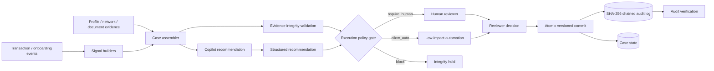

# Financial Crime Copilot

A synthetic reference implementation for **evidence-first, human-reviewable financial-crime case decision support**.

The important design choice is that a recommendation is **not** execution authority. Evidence integrity is checked independently, policy decides whether automation is allowed, material dispositions stay reviewer-authorized, and reviewer decisions are written to a tamper-evident audit chain.

> All customers, transactions, signals, scores and cases are synthetic. The project is not presented as a production AML ruleset.

## Architecture



## What is implemented

### Evidence and signal model

`copilot.py` defines explicit domain objects for:

- evidence with source, confidence, timezone-aware event time and attributes;
- deterministic/model-generated signals with evidence references;
- financial-crime cases with SLA and customer-impact context;
- structured recommendations with evidence IDs, missing information and uncertainty;
- reviewer decisions and override provenance;
- reviewer agreement / override quality metrics.

The recommendation path ranks risk signals and produces a bounded action from:

- `close`;
- `request_information`;
- `continue_monitoring`;
- `escalate`;
- `restrict`.

Material decisions are not silently auto-executed.

### Evidence integrity gate

`governance.py` validates the provenance graph before a recommendation can drive execution. It detects:

- duplicate evidence IDs;
- duplicate signal IDs;
- signals referencing evidence that does not exist;
- evidence confidence outside `[0, 1]`;
- signal scores outside `[0, 1]`;
- malformed or timezone-naive case/evidence timestamps;
- evidence dated materially after the case opened;
- stale evidence outside kind-specific freshness windows.

Blocking provenance defects produce a `block` policy outcome rather than allowing a narrative to masquerade as trustworthy evidence. Future-dated or unparseable evidence is blocking; stale evidence is retained for analyst context but downgrades otherwise automatic monitoring to human review.

Freshness is evaluated point-in-time against `case.opened_at`, not wall-clock time, so replaying a historical case remains deterministic. Default windows are 30 days for transaction, network and rule evidence, 90 days for geographic evidence, and 365 days for profile and document evidence. A five-minute forward skew is tolerated for distributed ingestion clocks.

### Recommendation vs execution policy

`PolicyGate` is intentionally separate from `Copilot.recommend()`.

The policy outcomes are:

```text
allow_auto
require_human
block
```

Material dispositions require a human reviewer. `continue_monitoring` is the only action eligible for automatic execution in this reference implementation, and it is still rejected for automatic execution when evidence is incomplete, contradictory or uncertain.

This means the architecture can use an LLM for bounded narrative generation later without granting the model policy authority.

### Reviewer API

`service/api.py` exposes a FastAPI service backed by SQLite:

```text
GET  /health
GET  /ready
POST /demo/seed
GET  /cases
GET  /cases/{case_id}
GET  /cases/{case_id}/recommendation
GET  /cases/{case_id}/policy
POST /cases/{case_id}/decision
GET  /cases/{case_id}/audit
GET  /cases/{case_id}/audit/verify
```

The end-to-end review flow is therefore testable over an HTTP boundary instead of existing only as an in-memory notebook/demo function.

### Human override and auditability

A reviewer can agree with or override the copilot recommendation. The recorded audit event includes:

- reviewer identity;
- copilot recommendation;
- reviewer action;
- whether the recommendation was overridden;
- reason;
- evidence IDs;
- signal IDs;
- timestamp.

Duplicate final decisions are rejected after a case has been resolved.

### Transactional review lifecycle

Reviewer decisions use an optimistic case version. The API reads a case snapshot,
returns its version to the reviewer, and accepts an optional `expected_version` with
the decision command. The repository then starts an immediate write transaction and:

1. verifies that the case is still open at the expected version;
2. chains and inserts the reviewer audit event;
3. writes the resolved case and increments its version;
4. commits both changes together.

If the version or state changed, the whole transaction rolls back with a conflict.
Consequently, two reviewers who loaded the same open case cannot both resolve it, and
an audit event cannot be committed without the matching case state.

The concurrency regression test starts two real threads from the same snapshot and
asserts exactly one successful decision, one conflict, one final audit entry and a
valid hash chain. This is a SQLite reference implementation of the same invariant a
production service would enforce with a conditional update or compare-and-swap.

### Tamper-evident audit chain

Reviewer events persisted in `decision_audit` are linked using SHA-256:

```text
GENESIS
   ↓
event 1 + previous_hash → event_hash_1
   ↓
event 2 + event_hash_1 → event_hash_2
   ↓
...
```

`CaseRepository.verify_audit_chain()` recomputes the chain. Modifying a persisted audit event without recomputing all downstream hashes causes verification to fail. This is **tamper evidence**, not a claim that SQLite itself is an immutable ledger.

### Analyst cockpit

`reviewer_ui.html` is a lightweight static analyst-cockpit prototype showing the intended reviewer experience: case summary, evidence, recommendation and human decision controls.

## Repository layout

```text
financial-crime-copilot/
├── copilot.py               # domain model + recommendation/prioritization
├── governance.py            # provenance validation + execution policy
├── service/
│   ├── api.py               # FastAPI review service
│   └── store.py             # SQLite repository + audit hash chain
├── tests/
│   ├── test_api.py          # HTTP review flow + policy + audit verification
│   ├── test_audit_chain.py  # untampered vs tampered audit behavior
│   ├── test_copilot.py      # recommendation / reviewer behavior
│   └── test_governance.py   # evidence integrity + policy boundaries
├── reviewer_ui.html
├── Dockerfile
├── pyproject.toml
└── README.md
```

## Run

Install and test:

```bash
pip install -e ".[dev]"
ruff check .
pytest -q
```

Run the domain demo:

```bash
python copilot.py
```

Run the API:

```bash
uvicorn service.api:app --reload
```

## CI and containerization

GitHub Actions validates:

- full-project Ruff checks;
- the pytest suite;
- the domain demo;
- packaged imports for both the API and governance layer;
- Docker image build in a separate job.

## Why this is not an “LLM wrapper” demo

The model boundary is deliberately narrow. Evidence IDs, provenance validation, prioritization, execution policy, reviewer authority and audit verification are deterministic and testable. A future LLM can draft a concise narrative from already-selected evidence, but it does not get to invent evidence, redefine policy or silently close material cases.

## Portfolio signal

**Agentic AI · Human-in-the-loop · FinTech · Financial Crime · Evidence Provenance · Policy Gates · FastAPI · Auditability · Responsible Automation**
