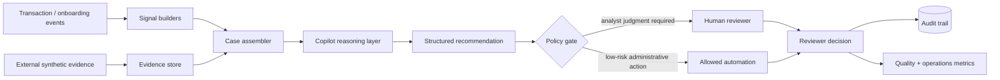
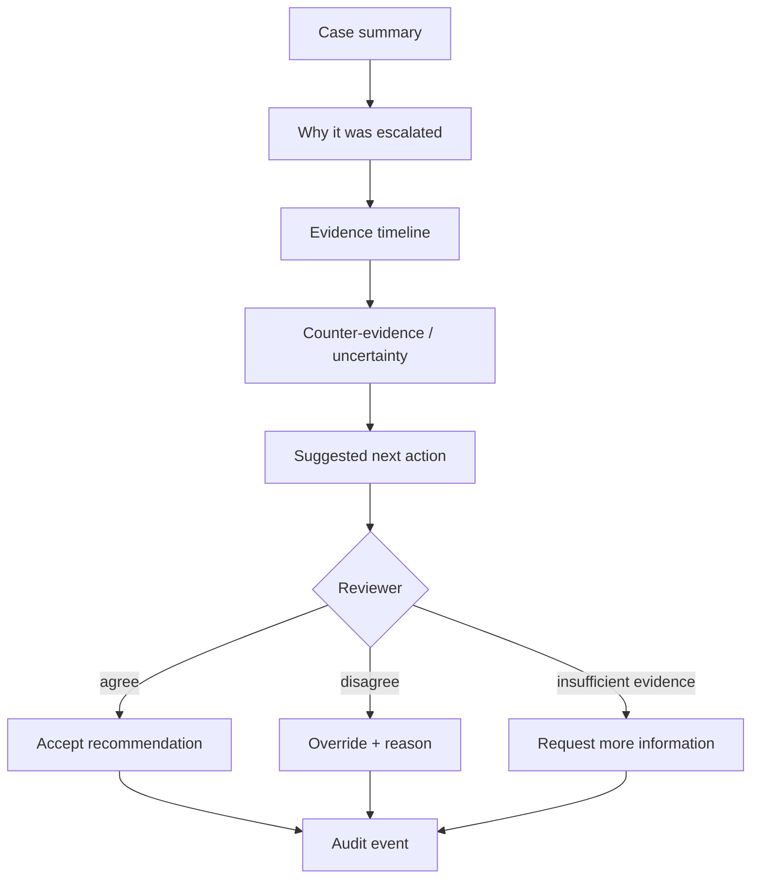

# Financial Crime Copilot

A synthetic reference project for **AI-assisted financial-crime case review**.

The copilot does not replace the reviewer. It organizes evidence, summarizes why a case was escalated, ranks review priority, proposes a next action and records enough provenance for a human to verify the recommendation.

## Design goal

A useful financial-crime assistant should reduce **search and synthesis work** without hiding uncertainty or turning the reviewer into a rubber stamp.

This project therefore separates:

1. **evidence** — what the system actually observed;
2. **signals** — deterministic or model-generated findings;
3. **recommendation** — what the copilot proposes;
4. **policy routing** — what actions are allowed;
5. **human decision** — the final reviewer action;
6. **audit** — what happened and why.

## Architecture



## Reviewer experience



## What the copilot surfaces

- case priority and SLA risk;
- suspicious-pattern signals;
- evidence provenance;
- contradictory evidence;
- a concise case narrative;
- uncertainty and missing evidence;
- proposed next-best action;
- reviewer override logging;
- model-versus-human disagreement metrics.

## Example synthetic signals

The demo includes generic portfolio-safe patterns such as:

- unusual amount relative to an account baseline;
- rapid movement of funds through multiple counterparties;
- circular transfer pattern;
- burst of new counterparties;
- geographic inconsistency;
- customer-profile / transaction mismatch;
- repeated cash-like activity near a configurable threshold.

These are educational examples only and are not represented as a production AML ruleset.

## Repository layout

```text
financial-crime-copilot/
├── copilot.py           # domain model, evidence, signals and reviewer workflow
├── reviewer_ui.html     # static analyst-cockpit prototype
└── README.md
```

## Run

```bash
python copilot.py
```

All entities, transactions, scores and evidence are synthetic.

## Portfolio signal

**Agentic AI · Human-in-the-loop · FinTech · Financial Crime · Evidence Provenance · Decision Support · Auditability · Responsible Automation**
